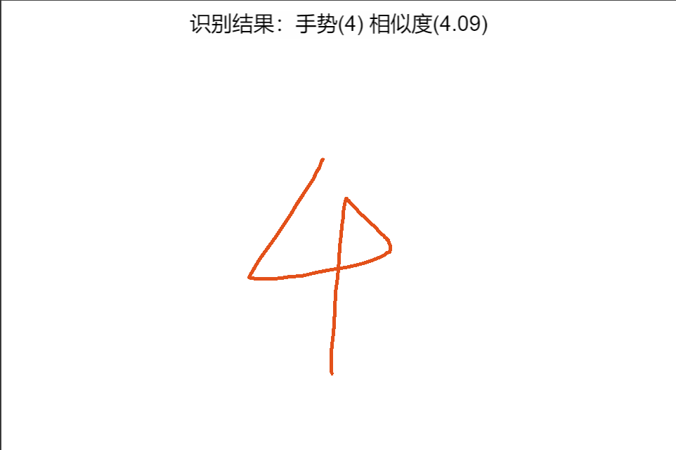

# ccc-gesture-recognition

**2022.03.03 重要更新：本项目已废弃，但仍可以当作学习使用，目前已经有了更新方案，详情请参考: [手势识别与训练模型](https://wu57.cn/Game/gestures/)。**

本项目是基于 Cocos Creator 完成的一个手势识别项目 demo，目前 demo 只添加了数字 0-9 的识别库，其他有需要请自行去[训练模型](http://uwdata.github.io/gestrec/)中添加后导出自用。

项目中关键的手势识别的技术使用的是 [gesrec](https://github.com/uwdata/gestrec)。

[gesrec](https://github.com/uwdata/gestrec) 的优点是有一个训练模型，输入越多，它的准确率就越高。

但它的缺点页也很明显，一是只能识别一笔画的图形；二是输入越多，输出的配置也越大。

上述缺点对 PC、Web 平台的项目没有太大的影响，但是在微信小游戏之类的H5快应用平台上则需要考量。在做这个 demo的过程中，我总结出几点供大家参考：

- 由于只能一笔画，所以某些图形不好画的，最好就不要出现，比如数字 5；

- 还有相似的图形不要放在一组里，比如数字 0和字母 O，数字 2和字母 Z，数字 1和字母 i，等等；

- 微信小游戏不允许加载 json文件，直接将 json配置改为导出 js文件然后导出变量即可。

PS：

如果有更好的方法或者图形识别的 js库烦请告知，谢谢。

**效果演示：**

